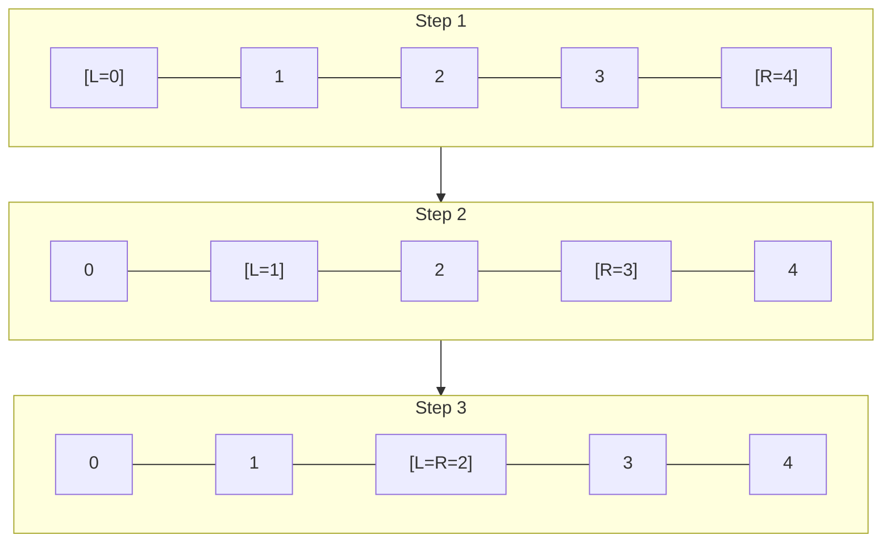
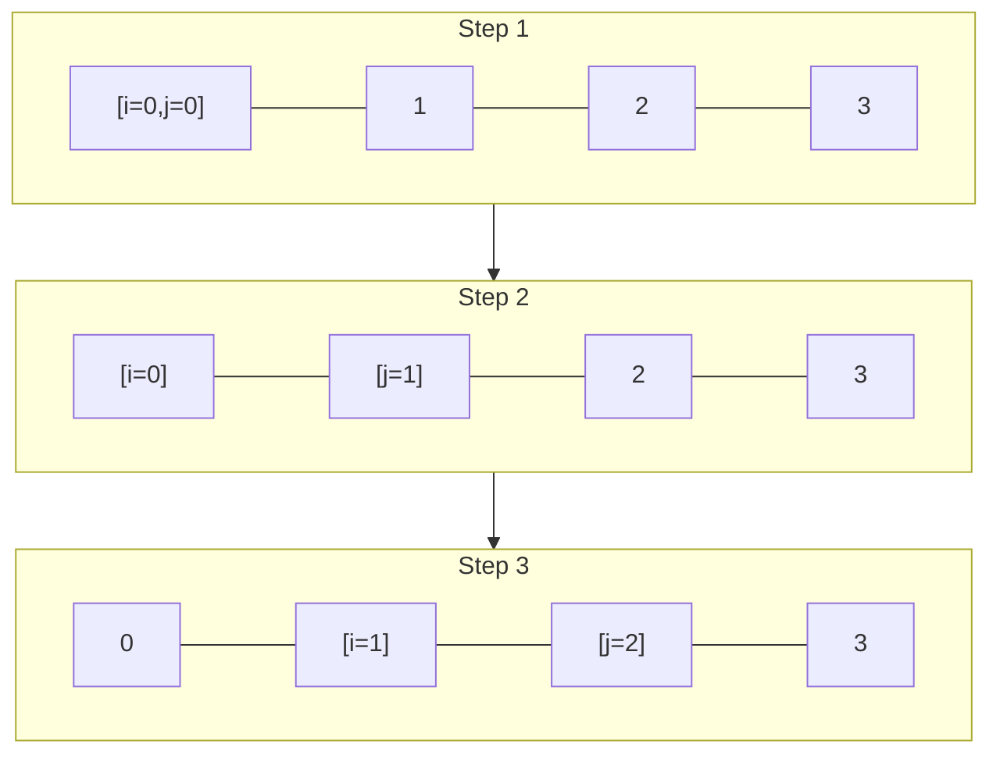
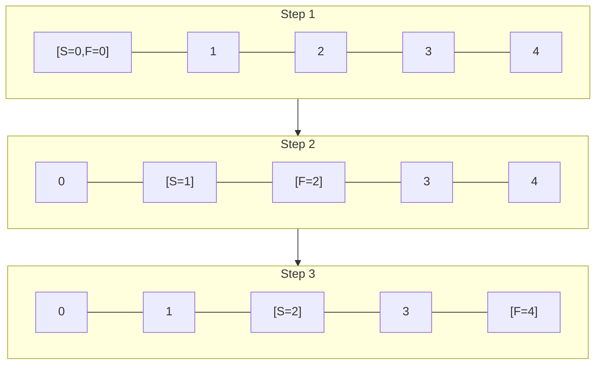

# Two Pointers

The **two-pointer** technique uses two indices to traverse a data structure, reducing time complexity by avoiding nested loops.

<!-- end_slide -->

## Opposite Direction

Both pointers start at opposite ends and move toward each other.

<!-- end_slide -->

**Algorithm:**
1. Set `left = 0` and `right = len - 1`.
2. While `left < right`:
   - Evaluate the condition at `arr[left]` and `arr[right]`.
   - If a match is found, return the result.
   - If the value is too small, increment `left`.
   - If the value is too large, decrement `right`.
3. Return the result.

<!-- end_slide -->

## Same Direction

Both pointers move in the same direction, often at different speeds or conditions.

<!-- end_slide -->

**Algorithm:**
1. Set `i = 0` and `j = 0`.
2. While `j < len`:
   - If `arr[j]` satisfies the condition, process or swap `arr[i]` with `arr[j]`, then increment `i`.
   - Increment `j`.
3. Return the result.

<!-- end_slide -->

## Fast & Slow

One pointer moves faster than the other — commonly used for cycle detection and finding midpoints.

<!-- end_slide -->

**Algorithm:**
1. Set `slow = head` and `fast = head`.
2. While `fast` and `fast.next` exist:
   - Move `slow` one step forward.
   - Move `fast` two steps forward.
   - If `slow == fast`, a cycle is detected — return.
3. Return `slow` (midpoint if no cycle).

<!-- end_slide -->

## Complexity

| Variant | Time | Space |
|---------|------|-------|
| Opposite Direction | O(n) | O(1) |
| Same Direction | O(n) | O(1) |
| Fast & Slow | O(n) | O(1) |
